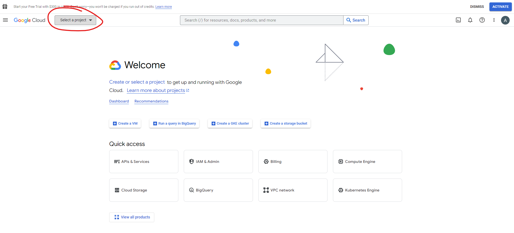
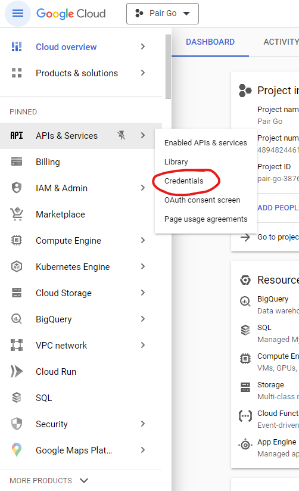
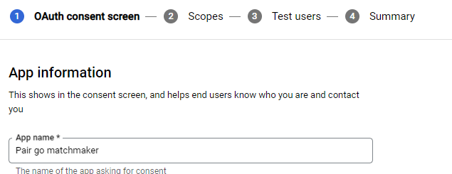
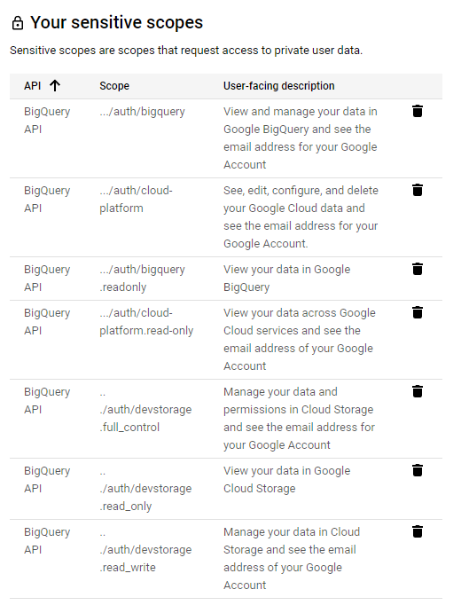
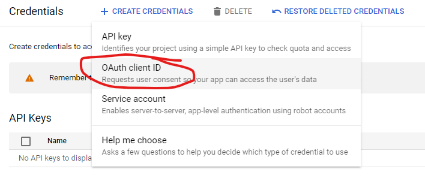
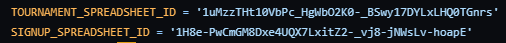
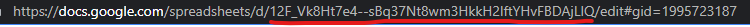

## One-time Setup Instructions (20-30 mins)

The following six files are required for the program to run: 
- matchmaker.py
  - This is the main Python script.
- credentials.json
  - This file contains your Google credentials so that the Python script can access Google Drive documents.
  - Instructions below on how to download.
- main_registrant_data.XXXXXX.csv
  - Email the Go Congress registrar for them to export the csv containing the information of all congress registrants.
- override.csv
  - Download 2023 version from [here](https://drive.google.com/drive/folders/1f9Kag0ZQ56eDHSvFO0wmvj8SNfsbg9Ti?usp=sharing)
  - This file contains rank information of players that will override their official AGA rating for cases of self-promotion or missing AGA rank. 
- generate_attendees.py
  - This script generates attendees.csv from the main_registrant_data.csv and their official AGA rank
- attendees.csv
  - This will be generated by generate_attendees.py

### Downloading credentials.json

You can follow the [instructions provided by Google](https://developers.google.com/docs/api/quickstart/python)



Create a new project with any name (e.g. "Pair Go").

Go to APIs & Services -> Credentials



#### OAuth Consent Screen

Choose External for consent screen

Pick a name for the app

Add your email to required fields



Add these scopes



Add your email as a test user

### Gettings credentials.json

Go to Create Credentials -> OAuth client ID



Download JSON and rename to credentials.json

### Setting up Google files

Make a copy of the [template files here](https://drive.google.com/drive/folders/1gv6l1rI5Mci498kiZeP2z3UkYQp-BQ2j?usp=sharing)

Be sure to change the places marked with Xs to the correct information.

Open the matchmaker.py and fill in the correct spreadsheet IDs, which can be found in the URL of the document.
Example:



### Generating attendees.csv

Once you have received the main_registrant_data.csv from the go congress registrar, you can run the generate_attendees.csv script to generate attendees.csv. Make sure they are in the same folder.

### Setting up an IDE to run Python

1. Install [Visual Studio Code](https://code.visualstudio.com/Download)
2. Install [Python](https://www.python.org/downloads/)
3. Open the folder containing matchmaker.py in Visual Studio Code
4. Press Ctrl+Shift+P and seach for "Python: Create Environment" -> "Venv" -> Select installed Python version
5. Open a new Terminal (Terminal -> New Terminal Ctrl+Shift+`)
6. Install missing packages in the terminal using
```
pip install fuzzywuzzy
pip install --upgrade google-api-python-client google-auth-httplib2 google-auth-oauthlib
```
