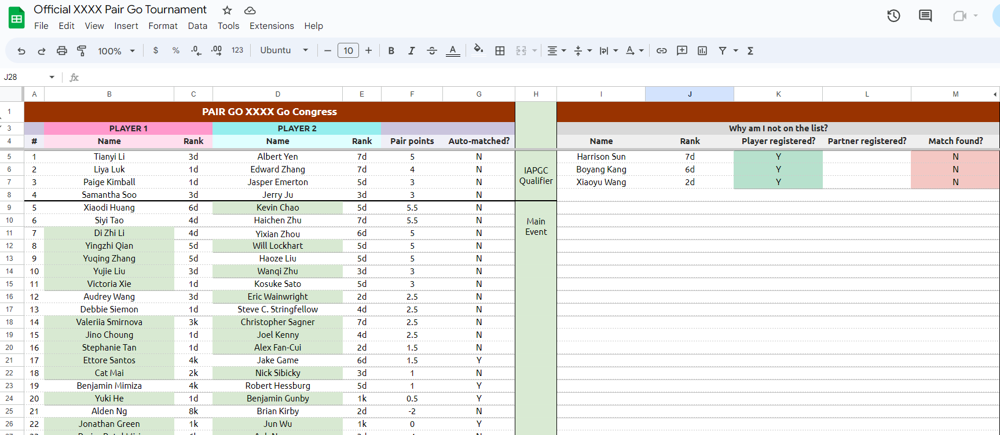
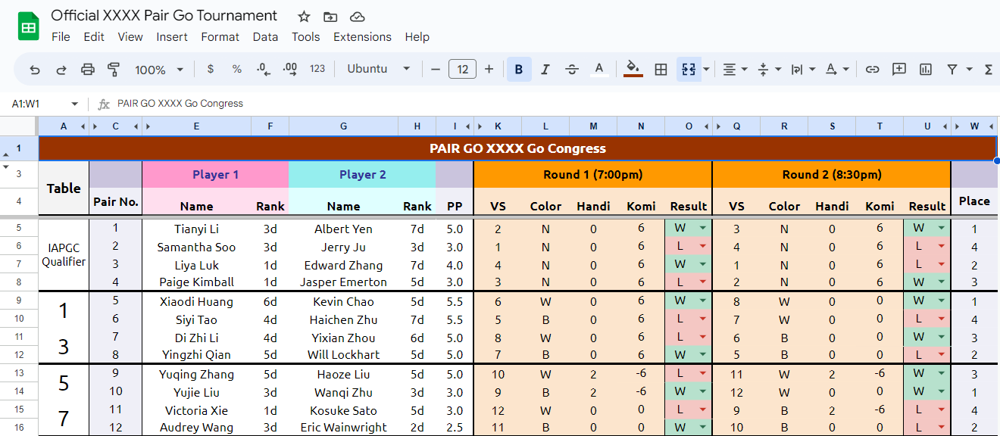

## Running the tournament

### Overview of registration pipeline

Players should have the option to signup via Google Form or paper signups at the Go Congress. You will need to fill out a Google Form for any paper signups so having players fill the form themselves is preferable.

These Google Form responses will be collected in a Google Sheet with the name "XXXX Pair Go Sign-up Form (Responses)".

When matchmaker.py is run, the script will look at the Google Form responses and verify their registration in the attendees.csv file. Verified pairs will be updated to the primary Google Sheet titled "Official XXXX Pair Go Tournament". Players that are looking for a partner and not matched yet will appear on the right. The columns on the right will also indicate if the player or their partner is not yet registered for the Go Congress. Note that sometimes this may be due to typos.



### Pairings

The "Pairings" tab of the "Official XXXX Pair Go Tournament" spreadsheet will be autopopulated from the player list. On the day of the tournament, results will be recorded live in the small dropdowns to choose W/L. The opponents and handicaps for Round 2 will be autopopulated. Typically, players can start Round 2 as soon as their opponents are ready.



## What to do if...

## a player is dropping out.
Delete their Google form response from the response spreadsheet. Rerun the script.

### there is a typo in someone's Google Form response.
Edit the responses spreadsheet directly to fix the typo. Rerun the script.

### you need all emails of participants.
Uncomment the last line of matchmaker.py and rerun the script.
```
m.display_all_emails()
```
